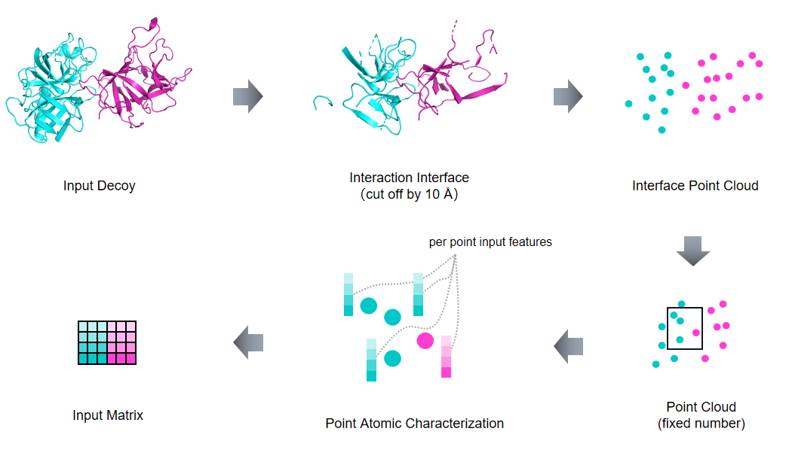
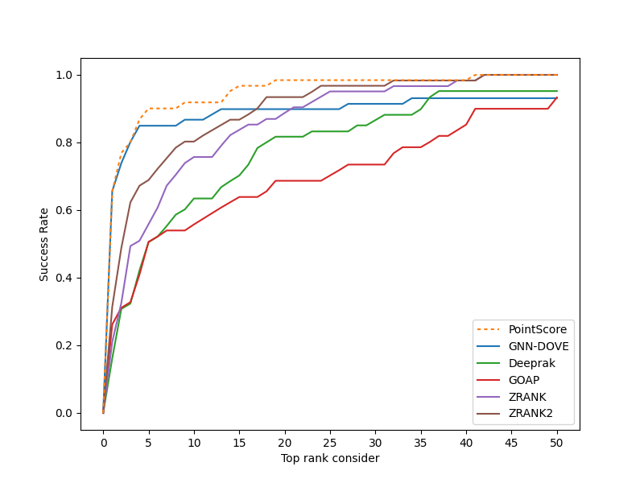
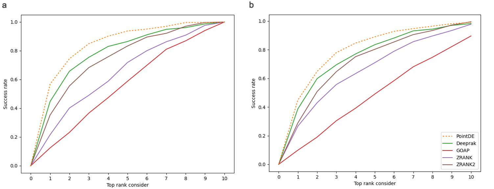
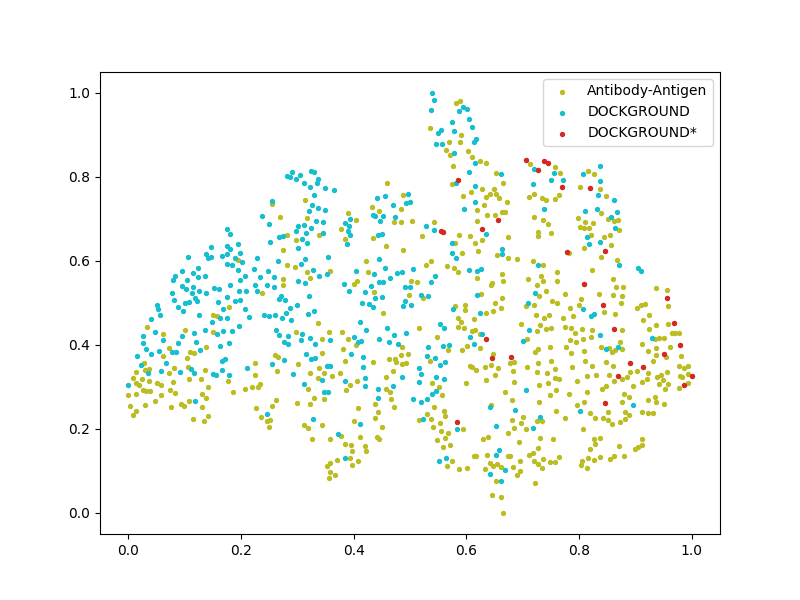

# PointScore

PointScore is a 3D point cloud neural network for protein docking scoring.

## Abstract
Protein-protein interactions (PPIs) play essential roles in maintain life. Due to the high cost of experimental methods, computational methods such as protein-protein docking are being developed to predict protein structure. However, there is still a challenge to select the near-native decoys generated by protein-protein docking. Here, we propose a scoring method based on 3D point cloud neural network named PointScore. PointScore can directly convert protein structure into point cloud vector and extract interaction information through the state-of-the-art point cloud geometries capture architecture and intermolecular grouping mechanism for protein complexes. On several published datasets, PointScore surpasses the state-of-the-art methods using deep learning. To further explore the application potential of our method in antibody-antigen interface analysis, we developed a new decoy set generated by high-quality antibody-antigen structures. Our method has also significantly improved compared with other baselines on our new antibody dataset.

## Data process
<p align="center">
  
</p> 

## Requirements
 - Python 3.6
 - Torch 1.5.1
 - scikit-learn

## Installation  
### 1. [`Install Git`](https://git-scm.com/book/en/v2/Getting-Started-Installing-Git) 
### 2. Clone the repository in your computer 
```
git clone https://github.com/AI-ProteinGroup/PointScore && cd PointScore
```

### 3. Install Requirements
```
conda create -n PointScore python=3.6
conda activate PointScore
pip install -r requirements.txt 
```

### 4. [`Download Models`](https://drive.google.com/file/d/13HSlVYjQwyhoHdQNLDt91eKSG4zwpWeN/view?usp=sharing)

That downloads the models for cross-validation on DOCKGROUND.

## Usage
### 1 Preprocess Data
```
python preprocess.py --p_num [process_number] --npoint [N] --dataset_dir [dataset_dir] --data_sv_dir [special_data_dir]
```
preprocessing should specify a pdb file with Receptor chain ID 'A' and ligand chain ID 'B'. pdb file must be in a folder named PDB ID. num_workers is used to specify the number of theads to process data.

File Example:
```
dataset dir  
│
└───1A2Y
│   │   1A2Y_01.pdb
│   │   1A2Y_02.pdb
│   │   ...
│   
└───1A2K    
│   │   1A2K_01.pdb
│   │   1A2K_02.pdb
│   │   ...
│
```

### 2 Train Model
```
python train.py --data_dir [data_dir] --gpu=[gpu_id] --batch_size [batch_size] --checkpoint [save_checkpoint_dir]
```
main.py should specify a file preprocessed by preprocess.py; --gpu is used to specify the gpu id; trianing model will be saved in [checkpoint_dir].

The models for cross-validation on DOCKGROUND [`here`](https://drive.google.com/file/d/13HSlVYjQwyhoHdQNLDt91eKSG4zwpWeN/view?usp=sharing).

### 3 Evaluate protein complex
```
python eval_ssr.py --gpu=[gpu_id] --fold [fold] --data_dir [data_dir] --sv_dir [sv_dir] 
```
eval_ssr.py should specify the directory that inclues pdb files with Receptor chain ID 'A' and ligand chain ID 'B'; --fold should specify the fold model you will use, where -1 denotes that you want to use the average prediction of 4 fold models and 1,2,3,4 will choose different model for predictions.
The output will be kept in [ssr_sv/{sv_dir}]. The prediction results will be kept in {PDB ID}.txt.   

## Dataset

### 1 DOCKGROUND [`link`](http://dockground.compbio.ku.edu/)

### 2 CAPRI socre_set [`link`](http://cb.iri.univ-lille1.fr/Users/lensink/Score_set/)

### 3 Antibody-Antigen benchmark [`link`](https://drive.google.com/file/d/1AIMgbbYovESTOvqu7qqqEG24BKgrtkXh/view?usp=sharing)

## Result 
### Performance on Dockground Dataset
<p align="center">
  
</p> 

### Performance on our new Antibody-Antigen Benchmark
<p align="center">
  
</p>

### T-SNE analysis
<p align="center">
  
</p>


