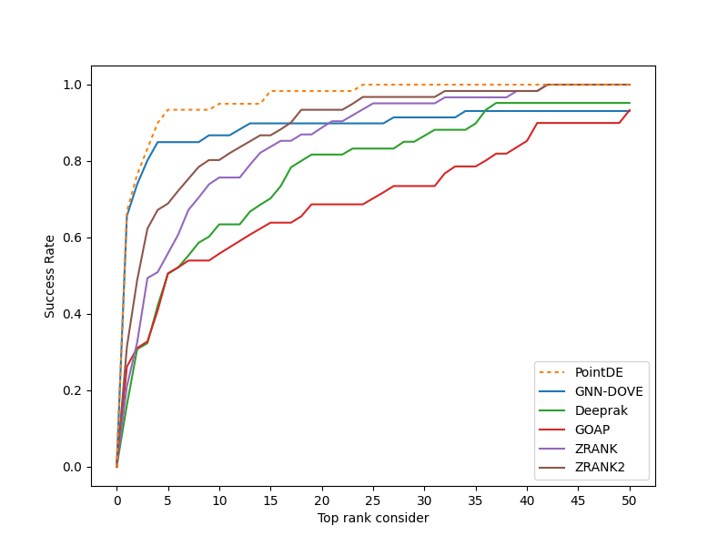

# PointDE

 PointDE is a 3D point cloud neural network for protein docking evaluation.

## Abstract
Protein-protein interactions (PPIs) play essential roles in many vital movements and The determination of protein complex structure is helpful to discover the mechanism of PPI. Protein-protein docking is being developed to modeling the structure of protein. However, there is still a challenge to select the near-native decoys generated by protein-protein docking. Here, we propose a docking evaluation method using 3D point cloud neural network named PointDE. PointDE transform protein structure to point cloud. Using the state-of-the-art point cloud network architecture and a novel grouping mechanism, PointDE can capture the geometries of point cloud and learn the interaction information from protein interface. On public datasets, PointDE surpasses the state-of-the-art method using deep learning. To further explore the ability of our method in different type protein structures, we developed a new dataset generated by high-quality antibody-antigen complexes. The result in this antibody-antigen dataset shows the strong performance of PointDE, which will be helpful for the understanding of PPI mechanisms.

## Data process
<p align="center">
  
</p> 

## Requirements
 - Python 3.6
 - Torch 1.5.1
 - scikit-learn
 - torchsampler

## Installation  
### 1. [`Install Git`](https://git-scm.com/book/en/v2/Getting-Started-Installing-Git) 
### 2. Clone the repository in your computer 
```
git clone https://github.com/AI-ProteinGroup/PointDE && cd PointDE
```

### 3. Install Requirements
```
conda create -n PointDE python=3.6
conda activate PointDE
pip install -r requirements.txt 
```

### 4. [`Download Pretrained Models (Option)`](https://drive.google.com/file/d/13HSlVYjQwyhoHdQNLDt91eKSG4zwpWeN/view?usp=sharing)

That downloads the models for cross-validation on DOCKGROUND.

## Usage
### 1 Preprocess Data
```
python preprocess.py --p_num [process_number] --npoint [N] --dataset_dir [dataset_dir] --data_sv_dir [special_data_dir]
```
preprocessing should specify a pdb file with Receptor chain ID 'A' and ligand chain ID 'B'. pdb file must be in a folder named PDB ID. num_workers is used to specify the number of theads to process data.

File Example:
```
dataset dir  
│
└───1A2Y
│   │   1A2Y_01.pdb
│   │   1A2Y_02.pdb
│   │   ...
│   
└───1A2K    
│   │   1A2K_01.pdb
│   │   1A2K_02.pdb
│   │   ...
│
```

### 2 Train Model

```
python train.py --data_dir [data_dir] --gpu=[gpu_id] --batch_size [batch_size] --checkpoint [checkpoint_dir]
```

After preprocessing the data, you are responsible for generating the division of training and testing data in the format specified in "document/training_annotation_example". Please ensure that you place these files in the preprocessed dataset folder.

main.py should specify a file preprocessed by preprocess.py; "gpu_id" is used to specify the gpu id; trianing model will be saved in "checkpoint_dir". "data_dir" is the path saved in the previous step "data_sv_dir".

The  models for cross-validation on DOCKGROUND [`here`](https://drive.google.com/file/d/13HSlVYjQwyhoHdQNLDt91eKSG4zwpWeN/view?usp=sharing).

### 3 Evaluate protein complex
```
python eval.py --gpu=[gpu_id] --fold [fold] --data_dir [data_dir] --sv_dir [sv_dir] 
```
eval.py should specify the directory that inclues pdb files with Receptor chain ID 'A' and ligand chain ID 'B'; --fold should specify the fold model you will use, where -1 denotes that you want to use the average prediction of 4 fold models and 1,2,3,4 will choose different model for predictions.
The output will be kept in [ssr_sv/{sv_dir}]. The prediction results will be kept in {PDB ID}.txt.   

## Dataset

### 1 DOCKGROUND [`link`](http://dockground.compbio.ku.edu/)

### 2 CAPRI socre_set [`link`](http://cb.iri.univ-lille1.fr/Users/lensink/Score_set/)

### 3 Antibody-Antigen dataset [`link`](https://drive.google.com/file/d/1AIMgbbYovESTOvqu7qqqEG24BKgrtkXh/view?usp=sharing)

## Result 
### Performance on Dockground dataset
<p align="center">
  
</p> 

### Performance on Antibody-Antigen dataset
<p align="center">
  
</p>

